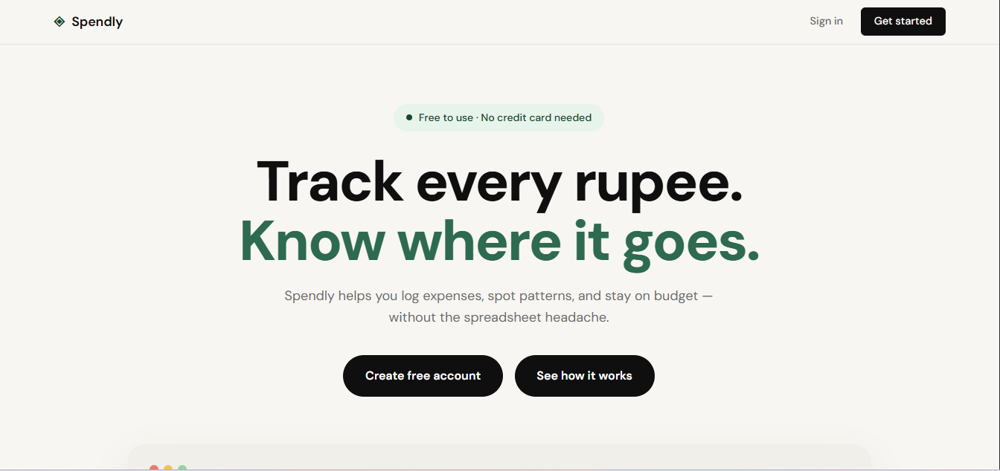
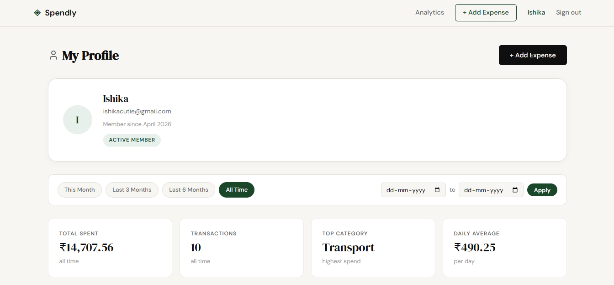
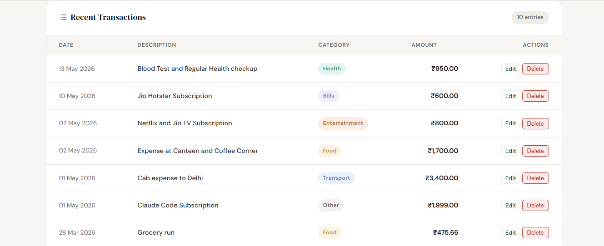
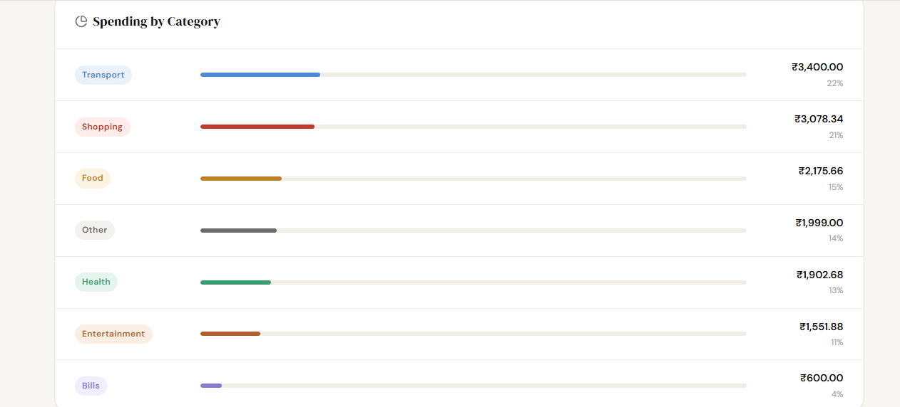

# Spendly

A lightweight personal expense tracker built with Flask and SQLite. Log expenses, filter by date range, and understand your spending patterns through a clean category breakdown — without a spreadsheet.

**Live:** https://spendly-production-88a7.up.railway.app

---

## Screenshots

### Landing Page



### Dashboard



### Recent Transactions



### Spending by Category



---

## Features

- **Account management** — register, log in, log out with password hashing via Werkzeug
- **Expense CRUD** — add, edit, and delete expenses; each scoped to the authenticated user
- **Date filtering** — filter the dashboard by preset ranges (This Month, Last 3 Months, Last 6 Months) or a custom date range
- **Spending summary** — total spent, transaction count, top category, and daily average update with every filter change
- **Category breakdown** — proportional bar chart showing spend per category with percentage share
- **CSRF protection** — token-based protection on all destructive POST forms

---

## Tech Stack

| Layer | Choice |
|---|---|
| Web framework | Flask 3.1 |
| Database | SQLite via the standard `sqlite3` module |
| Templating | Jinja2 (built into Flask) |
| Auth | Werkzeug `generate_password_hash` / `check_password_hash` |
| Frontend | Vanilla HTML, CSS, JavaScript — no build step |
| Icons | Lucide (CDN) |
| Deployment | Railway |

---

## Project Structure

```
spendly/
├── app.py                  # All routes — single file, no blueprints
├── database/
│   ├── db.py               # SQLite helpers: get_db(), init_db(), seed_db()
│   └── queries.py          # All SELECT/INSERT/UPDATE/DELETE query functions
├── templates/
│   ├── base.html           # Shared layout
│   ├── landing.html
│   ├── register.html
│   ├── login.html
│   ├── profile.html        # Dashboard
│   ├── add_expense.html
│   └── edit_expense.html
├── static/
│   ├── css/
│   │   ├── style.css       # Global styles and design tokens
│   │   └── landing.css     # Landing-page-only styles
│   └── js/
│       └── main.js
├── tests/                  # pytest test suite
├── requirements.txt
└── spendly_platform/       # Screenshots
```

---

## Database Schema

```sql
CREATE TABLE users (
    id            INTEGER PRIMARY KEY AUTOINCREMENT,
    name          TEXT NOT NULL,
    email         TEXT UNIQUE NOT NULL,
    password_hash TEXT NOT NULL,
    created_at    TEXT DEFAULT (datetime('now'))
);

CREATE TABLE expenses (
    id          INTEGER PRIMARY KEY AUTOINCREMENT,
    user_id     INTEGER NOT NULL REFERENCES users(id),
    amount      REAL NOT NULL,
    category    TEXT NOT NULL,
    date        TEXT NOT NULL,   -- ISO 8601: YYYY-MM-DD
    description TEXT,
    created_at  TEXT DEFAULT (datetime('now'))
);
```

Foreign key enforcement is enabled on every connection via `PRAGMA foreign_keys = ON`.

---

## Routes

| Method | Path | Description | Access |
|---|---|---|---|
| `GET` | `/` | Landing page | Public |
| `GET` `POST` | `/register` | Create account | Public |
| `GET` `POST` | `/login` | Authenticate | Public |
| `GET` | `/logout` | Clear session | Logged in |
| `GET` | `/profile` | Dashboard with stats, transactions, categories | Logged in |
| `GET` `POST` | `/expenses/add` | Add a new expense | Logged in |
| `GET` `POST` | `/expenses/<id>/edit` | Edit an existing expense | Logged in |
| `POST` | `/expenses/<id>/delete` | Delete an expense | Logged in |
| `GET` | `/terms` | Terms of service | Public |
| `GET` | `/privacy` | Privacy policy | Public |

---

## Local Setup

**Requirements:** Python 3.10 or later.

```bash
# Clone the repository
git clone https://github.com/HarshTomar1234/spendly.git
cd spendly

# Create and activate a virtual environment
python -m venv venv
source venv/bin/activate        # Windows: venv\Scripts\activate

# Install dependencies
pip install -r requirements.txt

# Run the development server (port 5001)
python app.py
```

The database is created and seeded automatically on first run. A demo account is available at `demo@spendly.com` / `demo123`.

---

## Environment Variables

| Variable | Default | Description |
|---|---|---|
| `SECRET_KEY` | `spendly-dev-secret` | Flask session signing key — set a strong random value in production |
| `FLASK_DEBUG` | `false` | Set to `true` to enable the Flask debugger locally |
| `PORT` | `5001` | Port the server binds to — Railway sets this automatically |

---

## Running Tests

```bash
pytest
```

To run a specific test file:

```bash
pytest tests/test_09-delete-expense.py -v
```

---

## Deployment

Spendly is deployed on Railway using the Railpack builder (auto-detected Python). The `PORT` environment variable is read at startup so Railway can assign the port dynamically.

To deploy your own instance:

1. Fork this repository
2. Create a new project on [Railway](https://railway.com)
3. Connect the GitHub repository as the service source
4. Set `SECRET_KEY` to a random value (e.g. `python -c "import secrets; print(secrets.token_hex(32))"`)
5. Railway will build and deploy automatically on every push to `main`

> The SQLite database is stored on the container filesystem and resets on each deploy. For persistent storage, attach a Railway Volume and update the database path in `database/db.py` to point to the mount path.

---

## Architecture Notes

- All routes live in `app.py` — no Flask blueprints. This keeps the codebase flat and easy to follow.
- All database logic lives in `database/queries.py` and `database/db.py` — routes never construct SQL directly.
- Every SQL query uses parameterized placeholders (`?`) — no string formatting in queries.
- The frontend uses no JavaScript framework and no npm build step — just vanilla JS loaded from `static/js/main.js`.
- CSRF protection is implemented with `secrets.token_hex` stored in the session and verified on every destructive POST.
